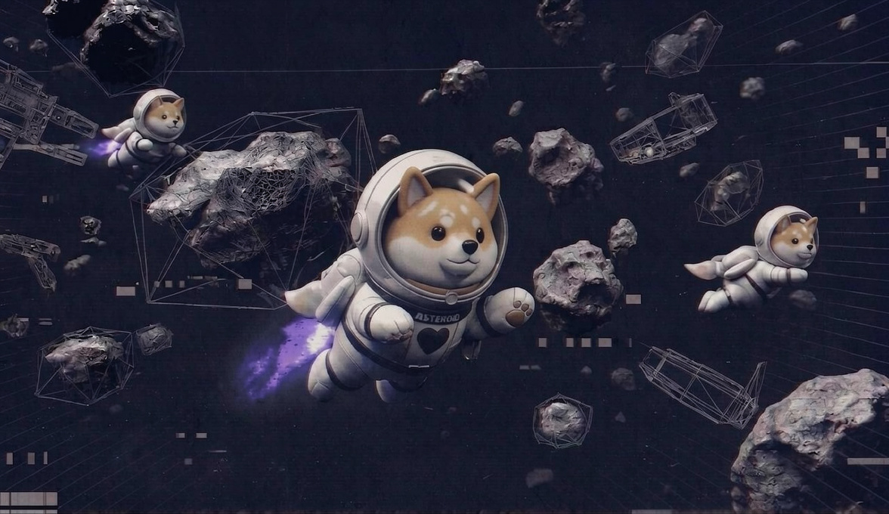

# Astroverse X

**The first socially expandable Community Multiverse P2E game** where meme coin communities can launch branded metaverse with configured 3D Mascots, in built Burn mechanisms, Casinos and more!


**Beta is live.** Browser play on mobile and desktop. No install. Jump in, stack PTS, and ride with the squad.


Fly with a virtual joystick and full **360° camera**, then drop into multiplayer: **live chat**, combat, nitro boosts, shops, clinics, casinos, and community-driven economies — all in one loop.

Players earn native **$ETH**, **$ASTROVERSE**, and admin-configured community tokens through quests, challenges, survival runs, and treasure hunts.\
\
Beta is live!

<a href="https://app.astroversex.com/" class="button primary" data-icon="gamepad">Play now</a>&#x20;

***

## Sub-Sections:

<table data-view="cards"><thead><tr><th></th><th></th><th data-hidden data-card-target data-type="content-ref"></th></tr></thead><tbody><tr><td><strong>Gameplay</strong></td><td>Solo Survival, social hubs, treasure hunts, racing — plus scoring and controls.</td><td><a href="play/gameplay/">gameplay</a></td></tr><tr><td><strong>Tokenomics</strong></td><td>$ASTROVERSE on ETH. Stealth launch. Revenue → burns, rewards, buybacks.</td><td><a href="tokenomics.md">tokenomics.md</a></td></tr><tr><td><strong>On-chain ads</strong></td><td>Mintable NFT placements with permanent visibility in-world.</td><td><a href="on-chain-ads.md">on-chain-ads.md</a></td></tr><tr><td><strong>Launchpad</strong></td><td>Meme communities ship their own branded Astroverse — token, mascot, rules.</td><td><a href="gameplay/multiverse-launchpad.md">multiverse-launchpad.md</a></td></tr></tbody></table>

***

## Core stack



### In the void

* Real-time multiplayer
* Space survival + PvP energy
* Social multiverse hubs
* Treasure hunts & racing
* Live in-game chat
* Browser-first (mobile + desktop)
* VR on the roadmap



### On-chain

* $ASTROVERSE utility & flywheel
* On-chain ad NFTs (Zenith / Core / Nebule bands)
* Community launchpad for branded worlds
* Quest & challenge rewards
* Planned LP lock + renounce (see [FAQ](faq.md))




**Why it hits different:** You're not grinding a dead lobby. Communities plug in mascots, tokens, and economies — the universe gets denser every launch.


<figure><figcaption>
Astroverse X — fly the void, stack rewards, own your lane.
</figcaption></figure>

***

## Quick links

|              |                                                     |
| ------------ | --------------------------------------------------- |
| **Play**     | [app.astroversex.com](https://app.astroversex.com/) |
| **Site**     | [astroversex.com](https://astroversex.com/)         |
| **X**        | [@astroverseX](https://x.com/astroverseX)           |
| **Telegram** | [t.me/astroverseX](https://t.me/astroverseX)        |
