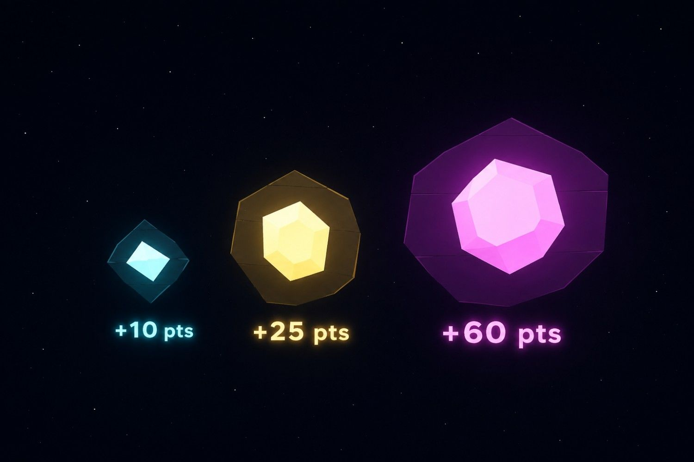

# Points System

### Points System

Earn points by surviving longer and collecting pickups throughout the game. Every second you stay alive increases your score, while special pickups give bonus points. Avoid asteroid collisions, as each hit reduces your total score.

<figure><figcaption></figcaption></figure>

#### How Points Work

* +10 PTS every second survived
* Pickups grant bonus points instantly
* Asteroid hits reduce points

<figure><figcaption></figcaption></figure>

#### Score Formula

**PTS = (Seconds Alive × 10) + Pickup Bonuses − (Asteroid Hits × 3)**

The longer you survive and the more pickups you collect, the higher your final score.
