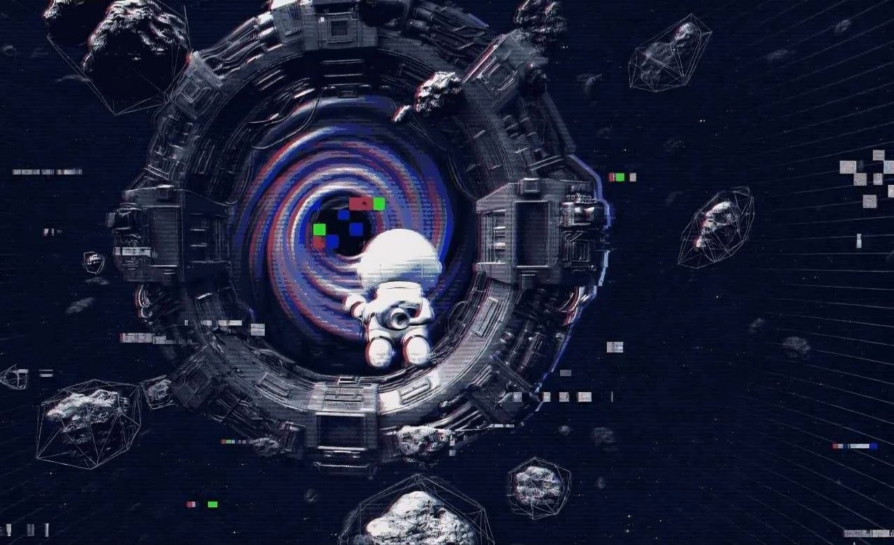

# Solo Survival

<figure><figcaption></figcaption></figure>

## Solo Survival

Solo Survival places players alone inside dangerous sectors of the Astroverse where survival is the primary objective.

Players must manage resources, navigate hazards, avoid destruction, and search for rewards hidden throughout the universe.

### Gameplay Features

* Space survival mechanics
* Energy management
* Shield systems
* Health systems
* Hazard zones
* Resource collection
* Hidden loot areas
* Enemy encounters
* Exploration rewards

### Objectives

Players must:

* Stay alive as long as possible
* Explore dangerous regions
* Collect resources
* Avoid hazards
* Discover rare loot
* Compete for leaderboard positions

### Future Expansion

Future updates may include:

* AI enemy systems
* Procedural sectors
* PvE missions
* Boss encounters
* Survival rankings
* Seasonal events
* Rare collectible drops
