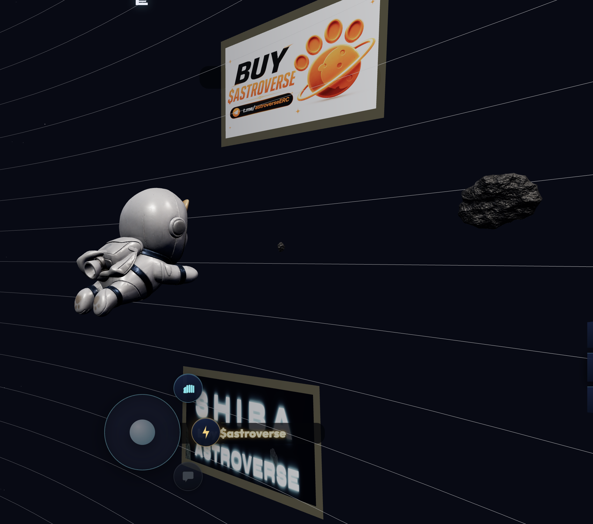

# 📰 On-chain Ads

* Sponsored space billboards
* Brand Activations

<figure><figcaption></figcaption></figure>

## On-Chain Ads

Shiba Astroverse introduces an interactive on-chain advertising ecosystem integrated directly into the universe.

Projects, communities, creators, and brands may be able to advertise inside the Astroverse through digital billboards and interactive advertising locations.

### Features

* Digital space billboards
* Interactive ad locations
* Community promotion systems
* Sponsored sectors
* Multiplayer visibility
* Persistent advertising zones

### Vision

The goal is to create one of the first interactive metaverse advertising systems connected directly to blockchain ecosystems.

### Future Expansion

Future advertising systems may include:

* NFT ad ownership
* Ad marketplaces
* Dynamic rotating ads
* Sponsored events
* Clan sponsorships
* Interactive campaigns
