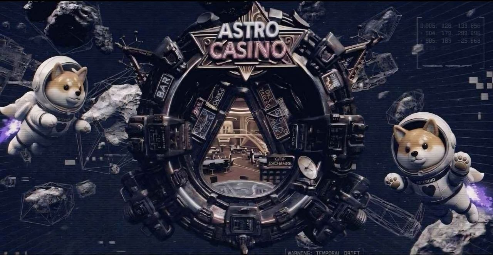

# Multiverse Social

<figure><figcaption>
Hubs, meetups, shared space — the universe stays alive.
</figcaption></figure>

**Multiverse Social** is the heartbeat of Astroverse X.

Shared multiplayer spaces where you meet, move, talk, and run community energy in **real time** — not a menu with a "friends online" counter.

***

## Live features

* Real-time player movement across hubs
* Community gathering zones and event areas
* **Public live chat** visible to everyone in-session
* Social sectors built for hangouts, not ghost towns
* Future creator districts and branded community worlds

***

## Why it matters

Most "metaverse" projects ship empty maps. Astroverse X is built so **players see each other** — chat scrolls, squads form, and meme communities can anchor **their** mascot in **their** slice of the multiverse ([Launchpad](../../gameplay/multiverse-launchpad.md)).


**Bull case:** Social density = retention = on-chain activity. Hubs aren't cosmetic — they're where partnerships and launches get noticed.


***

## Locations & economy (expanding)

The experience integrates **live chat** plus interactive locations:

* Shops
* Clinics
* Casinos
* Community-driven economies

Q3 2026 targets full expansion of these in-world locations — see [Roadmap](../../roadmap.md).

***

## On the roadmap

Voice chat, guilds, clan territories, player housing, hosted events, interactive spaces, UGC, and community tournaments.

<a href="https://app.astroversex.com/" class="button secondary">Drop into a hub</a>
