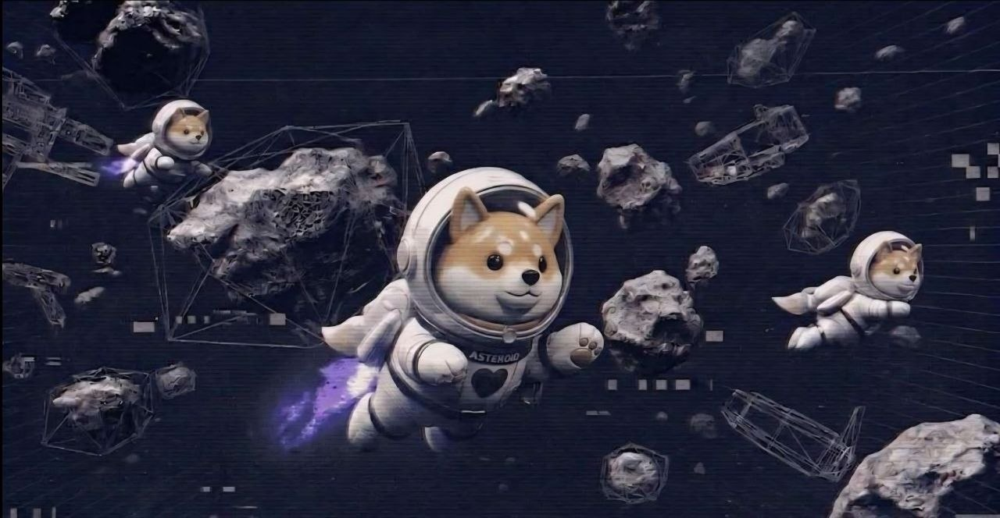

# Racing Mode

<figure><figcaption>
Speed runs and competitive laps.
</figcaption></figure>

**Racing Mode** is where movement skill pays.

Dangerous space tracks, **nitro boost**, tight lines, and multiplayer chaos — finish fast or eat dust.

***

## Features

* Multiplayer racing sessions
* Nitro boost for burst speed
* Competitive leaderboards
* Time attack pressure
* Seasonal tournament hooks (expanding)

***

## Competitive loop

* Grind lap times and board position
* Unlock achievements through performance
* Stack seasonal event entries as they go live


Racing pairs hard with [Multiverse Social](multiverse-social.md) — squad up in chat, then line up at the start.


***

## Coming later

Ranked mode, team racing, custom maps, spectator mode, tournament prize pools, and deeper betting/social integrations where legally viable.

