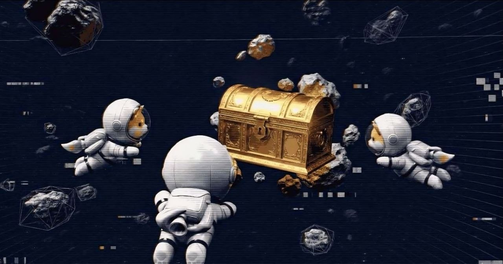

# Treasure Hunt

<figure><figcaption>
Chase rewards across the map.
</figcaption></figure>

**Treasure Hunt** is pure exploration dopamine.

Hidden rewards, rare pickups, and event loot scattered across sectors — first to the cache, first to the flex.

***

## Mode features

* Hidden reward zones and randomized spawns
* Exploration bonuses for map knowledge
* Time-limited treasure events
* Rare cosmetic unlocks
* Seasonal treasure rotations

***

## What you can earn

Rewards tie into the wider economy:

* **$ASTROVERSE** and quest/challenge payouts
* **$ASTROVERSE** and community-configured tokens on **Base** (per admin setup)
* Rare cosmetics and event items
* Limited collectibles
* Future NFT-linked drops


Rewards vary by event, season, and community world rules. Always check live announcements on [Telegram](https://t.me/astroverseX).


***

## Future scale

Clan treasure wars, universe-wide hunts, puzzle sectors, hidden dimensions, and legendary one-shot events.
