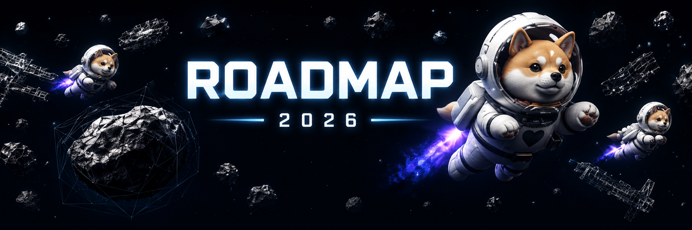

# 🛣️ Roadmap

<figure><figcaption></figcaption></figure>

## Q2 2026

* Complete in-game 3D assets and gameplay design
* Test game metaverse dynamics and gameplay mechanics
* Successfully launch beta version in browser — mobile and desktop
* Launch of $ASTROVERSE token
* Launch of Shiba Astroverse on-chain Ad NFTs
* In-game rewards via quests and challenges

## Q3 2026

* Complete expansion of in-game locations — casinos, clinics, shops, etc.
* Expanded metaverse with more game modes and social hubs
* Steam page and desktop build pipeline experiments
* Strategic partnerships and co-marketing campaigns
* Complete buyback & lock of 5% of total supply

## Q4 2026

* On-chain real-time degen space with integrated social interaction
* Native Oculus VR support for immersive gameplay
* More to come...
